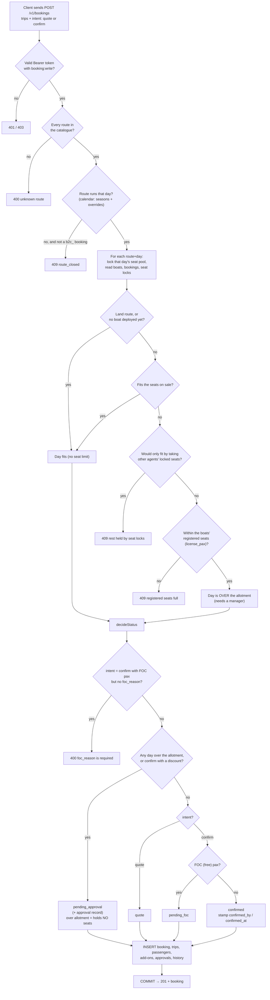
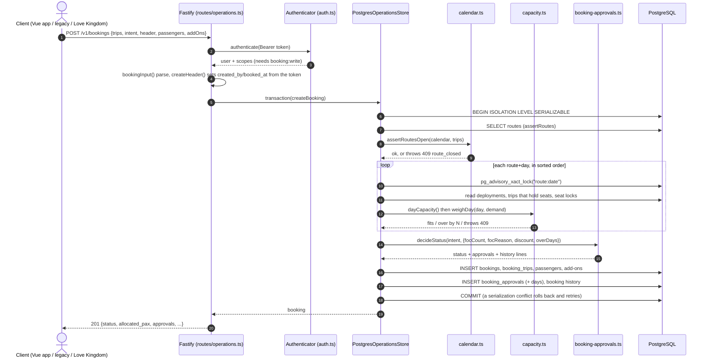

# Creating a booking: flowchart and sequence diagram

How `POST /v1/bookings` works, drawn from the code on `feat/route-calendar-rules` (2026-10-08).
Recovered from the Claude session that drew them. View the Mermaid blocks in the VS Code Markdown
preview, on GitHub, or at mermaid.live.

## In short

The client never picks the status. It sends the trips and says which button was pressed: `intent: "quote"` or `"confirm"`. The server then:
1. Checks you're logged in.
2. Checks every route exists and runs that day.
3. Weighs the seats day by day.
4. Decides the status from those facts.
5. Saves it all in one transaction (a group of writes that either all succeed or all undo).

If any day is refused, nothing is saved.

## Flowchart: `POST /v1/bookings`

## Sequence diagram: the same request, step by step

## What to notice

- **Seat-pool lock:** `pg_advisory_xact_lock` is a lock held only until the transaction ends, one per route+day. Two people booking the same boat on the same day wait in line instead of both getting the last seat. Days are locked in sorted order, so two bookings can't each grab one day and block each other.
- **Same rules in both stores:** the in-process store (`src/domain/operations.ts:548`) calls the same `weighDay` and `decideStatus`. Only the reading and writing of data differ.
- **Seat-holding rule:** a waiting over-allotment booking holds 0 seats until it's approved. Otherwise it would take the very room it's waiting for. A booking waiting only for a discount approval does hold its seats.
- **After create:** the status changes only through commands: `/confirm`, `/approve`, `/reject`, `/cancel`, `/cancel-weather`, `/restore`. `PATCH` changes client facts (names, notes, trips), and sending it a different `status` is a `400`.
