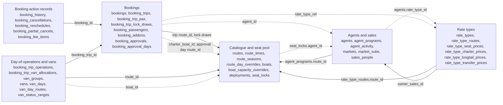
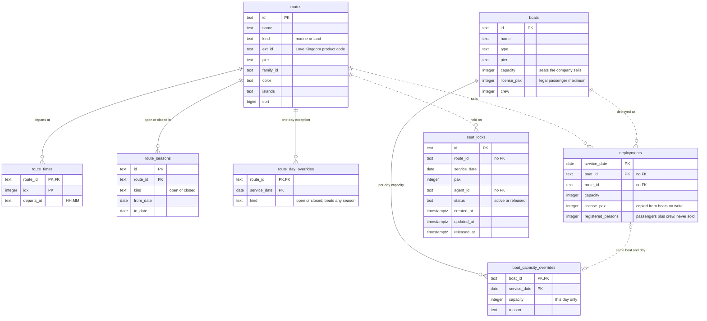
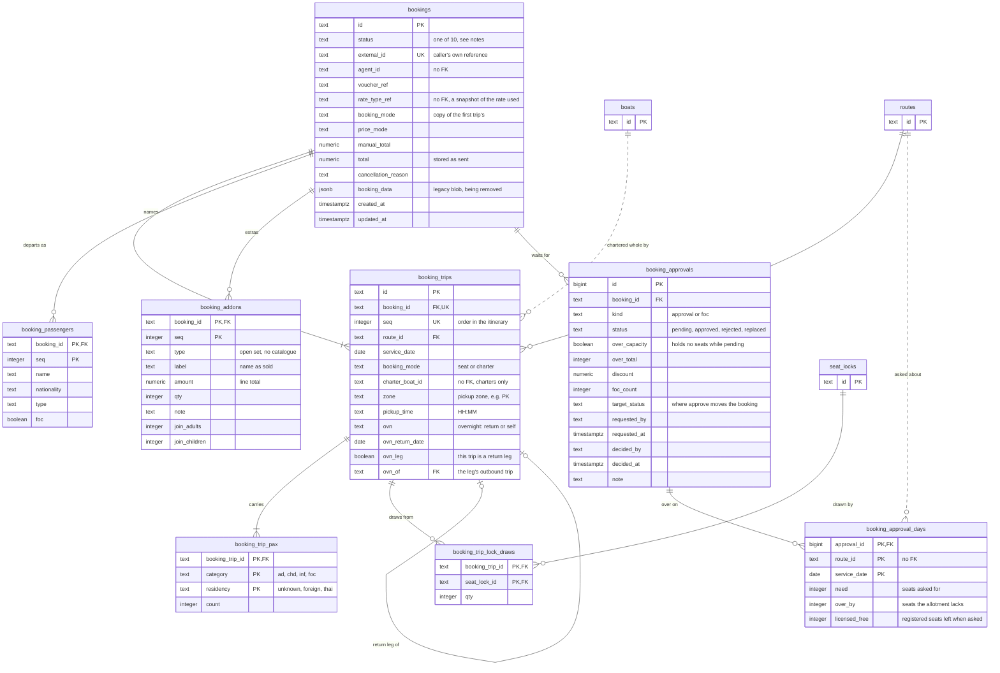
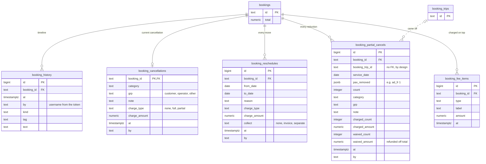
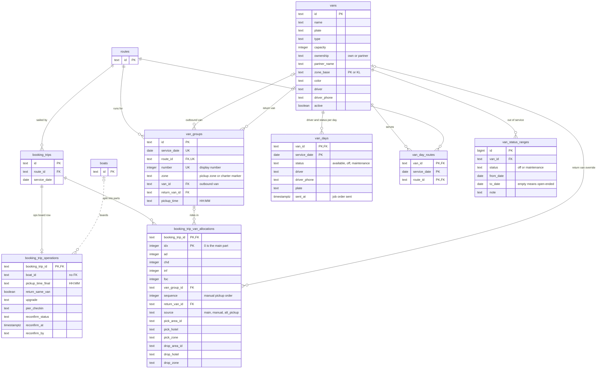
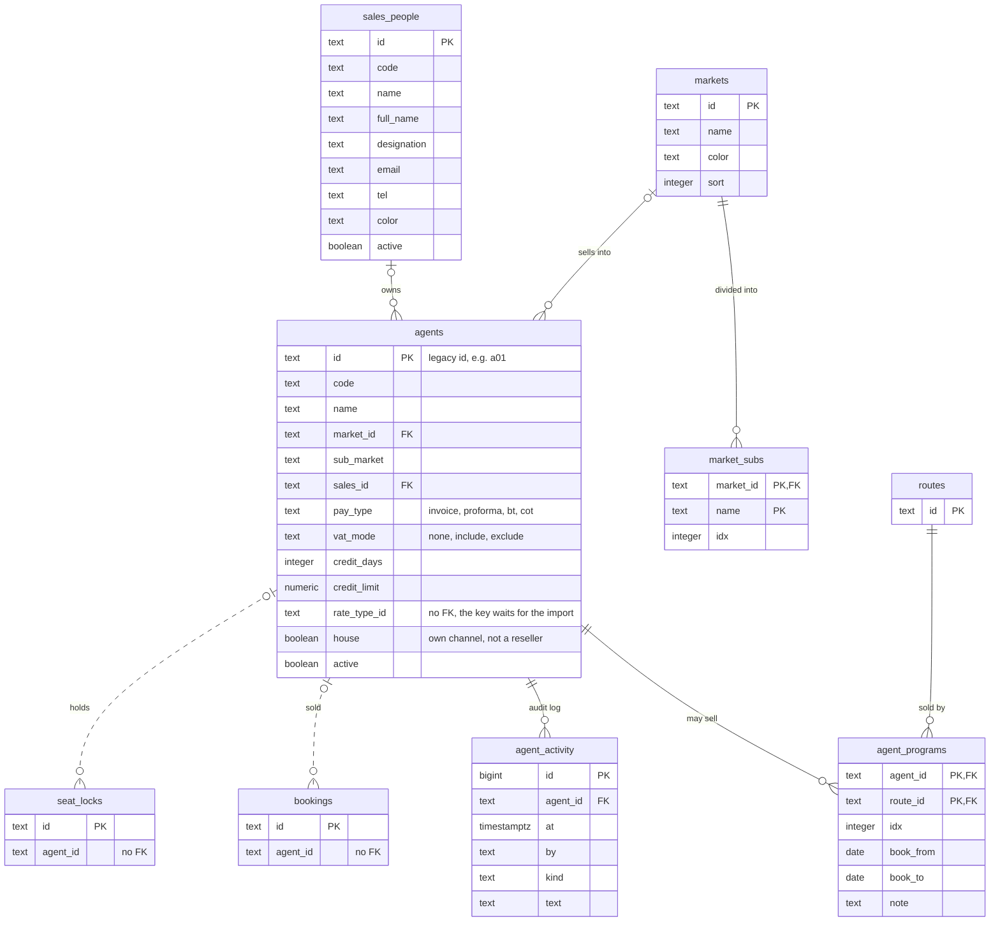
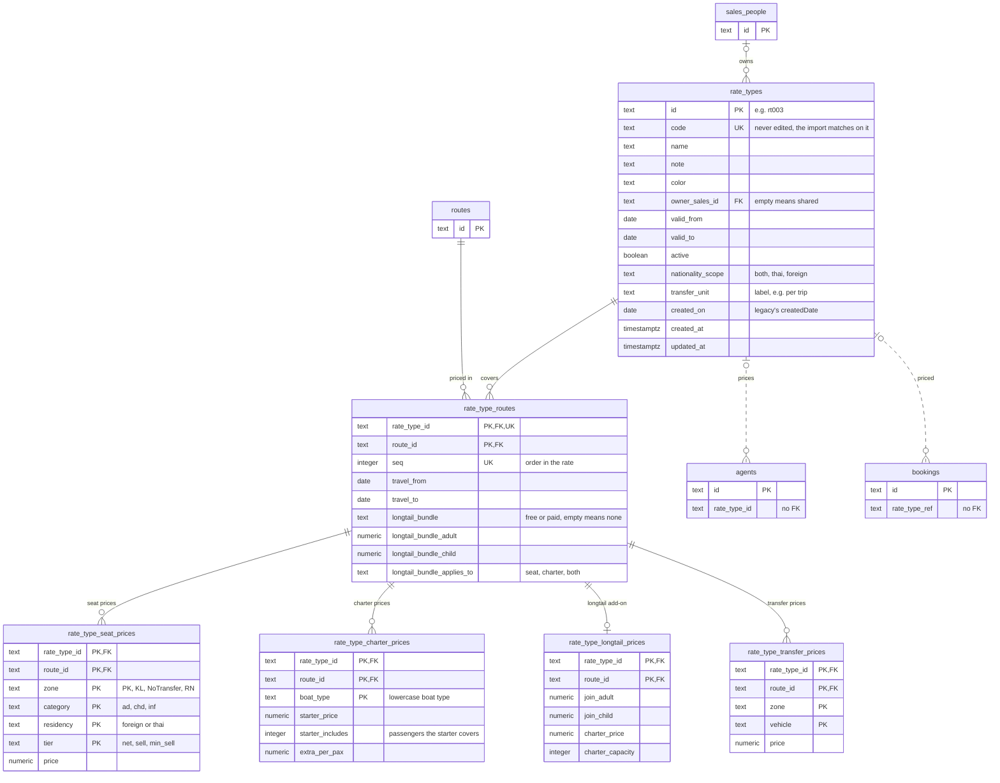

# Database schema

The PostgreSQL schema as `migrations/*.sql` builds it: 40 tables in six areas, plus `schema_migrations`,
the migrator's own ledger, which is not drawn.

Checked against every migration in `migrations/` (001–023) applied to an empty PostgreSQL 17
database on 2026-10-07. The
migrations are the authority. If this file disagrees with them, this file is wrong, and the fix
belongs in the same commit as the migration that moved the schema.

## Reading the diagrams

- **A box is a table.** Each line in it is a column: type, name, key, and sometimes a short note.
  `PK` is the primary key, `FK` a foreign key, `UK` part of a unique constraint.
- **A line is a relationship.** The ends say how many rows can be on that side: a bar is *one*, a
  circle means *zero is allowed*, and a crow's foot (three prongs) is *many*. So bar-to-crow's-foot
  reads "one route has many route seasons".
- **Solid line: a real foreign key.** The database refuses a row whose id points at nothing.
- **Dashed line: an id with no foreign key.** The column holds another table's id, but only the
  application keeps it valid, or nothing does. These are listed under
  [Ids with no foreign key](#ids-with-no-foreign-key).
- A table that belongs to another area appears with only its key columns, to show where the line goes.

## Overview

An arrow points from the area holding an id to the area it names.

## 1. Catalogue and seat pool

What runs, and how many seats there are to sell. Routes and boats are the catalogue. A
deployment puts a boat on a route for one day, and that is what creates seats.

- **A boat sails one route per day.** `deployments` is keyed on `(service_date, boat_id)`, so
  deploying the same boat again that day *moves* it rather than adding a second row.
- **Seats a boat sells** = the day's override capacity (or else the deployment's capacity), capped
  at `license_pax`. `registered_persons` is passengers plus crew and is never a selling limit. The
  rule is written once, in `src/domain/capacity.ts`.
- **Seats left on a route-day are computed, not stored.** Each read sums what is deployed and
  subtracts what bookings and active locks hold. There is no counter column to fall out of step.
- **Whether a route runs on a date** is decided from `route_seasons` and `route_day_overrides` by
  `src/domain/calendar.ts`. A day override beats any season.
- **Land routes** (`kind = 'land'`) have no boats, so they have no deployments and no seats yet.
- **A seat lock** holds seats on one route-day for an agent. Bookings draw from it (see
  `booking_trip_lock_draws` below), and what it still holds is `pax` minus those draws.

## 2. Bookings

A booking is a **sale**. A trip is a **departure**. Seats are counted per trip, which is how one
booking can span several days.

- **Every booking has at least one trip, and every trip at least one pax row.** The API
  enforces this. The database can't: a plain constraint has no way to say "at least one child row".
- **A booking holds seats unless its status is `cancelled`, `rejected` or `cancelled_weather`,** or
  it is `pending_approval` with a pending approval that is over the allotment
  (`over_capacity = true`). The ten statuses are listed in `src/domain/booking-status.ts`, and the
  approval exception is `bookingHoldsSeats` in `src/domain/booking-approvals.ts`. The database only
  checks that the status is one of the ten.
- **A charter takes a whole boat.** `charter_boat_id` names it, and all that boat's sellable seats
  leave the pool, however few passengers the charter carries.
- **A lock draw** says how many of a trip's seats came out of an agent's seat lock, so those seats
  aren't counted twice. A lock that has been drawn from can't be deleted: the foreign key has no
  `ON DELETE`.
- **Overnight trips:** a trip with `ovn = 'return'` is the outbound. Its return leg is a separate
  trip with `ovn_leg = true` and `ovn_of` pointing back at it.
- **Passengers and add-ons are whole lists.** An amendment that sends them replaces every row.
- **An approval is a row per request, kept after it is decided.** `kind` is `approval` (over the
  allotment and/or a discount) or `foc` (free passengers). A booking has at most one `pending`
  approval per kind: asking again marks the old one `replaced`. `booking_approval_days` keeps the
  route-days an over-allotment approval was about, as they were when it was asked. A legacy-imported
  `pending_approval` booking has no approval row, and holds its seats.
- **Deleting a booking deletes everything under it.** Its trips, pax, passengers, add-ons,
  approvals and action records all cascade.

The `bookings` box shows the structural columns. The other 57 columns are the header: values the
booking form writes, one column each. `foc_reason` came in migration 023, the rest in 011.

| Group | Columns |
| --- | --- |
| Sale | `schema_ver` `sold_by` `purpose` `staff_id` `staff_purpose` `booking_date` `booked_at` `created_by` `updated_by` `confirmed_at` `confirmed_by` |
| Lead passenger | `lead_pax` `lead_nationality` `lead_type` `lead_foc` `lead_phone` `lead_email` |
| Pickup and drop-off | `pickup_area_id` `pickup_self` `pickup_area` `pickup_zone` `hotel_name` `room_number` `dropoff_same` `dropoff_area_id` `dropoff_area` `dropoff_hotel_name` |
| Guides | `guide_english` `guide_russian` `guide_chinese` `guide_other_lang` |
| Passenger needs | `pax_type` `special_meals_veg` `special_meals_vegan` `special_meals_halal` `special_meals_allergies` `large_luggage` |
| Cash on tour | `cash_on_tour_amount` `cash_on_tour_currency` `cash_on_tour_handling` `cash_on_tour_note` |
| Price breakdown | `price_seat` `price_addon` `price_foc_discount` `price_discount` `price_extra` |
| Payment snapshot | `payment_method` `payment_net_days` `payment_source` `payment_contract_version` |
| Market snapshot | `market` `market_sub` `market_agent_id` `market_at` |
| Notes | `notes` `note` |
| FOC | `foc_reason` |

How each header column is parsed from a request is in `src/domain/booking-header.ts`.

## 3. Booking action records

What the booking actions record beyond the seat change: who did it, why, and what it cost. The rules
are in `src/domain/booking-actions.ts`. These tables only hold the results.

- **`booking_history`** gets one line per write, in the same transaction as the write.
- **`booking_cancellations`** holds only the *current* cancellation: at most one row, and a restore
  deletes it. Earlier cancellations survive as history lines.
- **`booking_reschedules`** and **`booking_partial_cancels`** are append-only: a new row each time,
  never updated. Only the full request body writes one. The older bodies (a bare move, a bare
  passenger count) change the trips and leave a history line only.
- **`booking_partial_cancels.booking_trip_id` has no foreign key on purpose.** The record must
  outlive a trip that a later edit removes. `service_date` still says which departure it was.
- **What the agent owes** is `bookings.total` plus the booking's `booking_fee_items`. A fee never
  changes `total`.

## 4. Day-of-operations and vans

Who drives, which van, and who rides with whom. These tables are filled by the legacy import
(`src/tools/import-legacy.ts`), but **no API endpoint reads or writes them yet**. The planned
design is in `todo/trip-ops-and-vans-model.md`.

- **A trip's passengers can be split across vans.** A trip with no allocation rows rides as one
  whole part. Part `idx = 0` is the main part, and further parts are splits or alternate pickups.
- **A van group is one outbound van run.** The group holds the van, so passengers grouped together
  can't disagree about which van they're on. Its `zone` is the pickup zone it collects from, or
  `__CHARTER__` for a charter's own van. Deleting a group leaves its allocations ungrouped rather
  than deleting them.
- **Whether a van works on a date:** a `van_days.status` override beats any `van_status_ranges`
  range. `van_day_routes` is the month matrix of which routes a van serves on which dates.
- **Vans are never deleted:** a retired van is set inactive. The foreign keys onto `vans` have no
  `ON DELETE`, so a van still in use can't be removed anyway.
- **Moving a trip to another route or day clears its van data,** because it was arranged for the
  old departure (`writeTrips` in `src/domain/postgres-operations.ts`).

## 5. Agents and sales

The resellers who sell trips, the markets they sell into, and the salespeople who own them. The
API serves this area read-only. The rows arrive through the legacy import, with legacy's ids.

- **`agent_programs`** lists the routes an agent may sell, with the booking window sales entered.
- **`house` agents** (`a_walkin`, `a_staff`, `a_b2c`) are channels the business sells through
  itself, not resellers.
- **Agents are never hard-deleted,** because bookings point at them.

The `agents` box shows the structural columns. The rest describe the agent:

| Group | Columns |
| --- | --- |
| Contact | `contact` `email` `phone` `note` `color` |
| Contract | `contract_template_id` `contract_status` `contract_version` `contract_start` `contract_end` |
| Company | `legal_name` `tax_id` `tat_license` `address` `company_tel` `hotline` `fax` `website` |
| Signatory | `signatory_name` `signatory_designation` `signatory_tel` `signatory_signed_date` |
| Booking channel | `booking_method` `booking_cutoff` `booking_cancel_policy` `booking_email` `booking_phone` |
| Audit | `created_at` `updated_at` |

## 6. Rate types

The price lists agents are sold at (migration 022). A rate type is a header; every price hangs off
one of its routes. The API reads and writes them, and the legacy import fills them with legacy's
ids. Nothing prices a booking from them yet. The design is in `todo/rate-types-model.md`.

- **Each price table points at `rate_type_routes` with a two-column key,** `(rate_type_id,
  route_id)`. A price exists only for a route on the rate, and taking the route off the rate deletes
  its prices. Deleting a rate type deletes its routes and all their prices.
- **Only tier `net` is billed.** `sell` and `min_sell` are printed on contracts.
- **A zone, a boat type, a vehicle or a route is a row,** so none of them needs a migration. Which
  zones a route takes depends on its pier, and the API checks it, not the database.
- **`valid_from`/`valid_to` and `travel_from`/`travel_to` do not stop a sale.**
- **A rate type that an agent or a booking names can't be deleted** through the API (`409`). The
  database would allow it: neither `agents.rate_type_id` nor `bookings.rate_type_ref` has a key.

## Ids with no foreign key

These columns hold another table's id, but the database does not check it. Where a migration
gives a reason, it is quoted; otherwise the table says what happened.

| Column | Points at | Why there is no key |
| --- | --- | --- |
| `booking_trips.charter_boat_id` | `boats` | The real rule, "deployed on this route that day", is stronger than a key, and both stores check it before writing (014). |
| `deployments.boat_id` | `boats` | Left out for the same reason. 014 says it and `charter_boat_id` "should gain a key together". |
| `deployments.route_id` | `routes` | Created (001) before the route catalogue existed (005). 008 added a key for `booking_trips.route_id` only. |
| `seat_locks.route_id` | `routes` | Same as `deployments.route_id`. |
| `booking_trip_operations.boat_id` | `boats` | Created without one (013). No API writes the column yet. |
| `bookings.agent_id` | `agents` | Created (002) before the agents table (017). No key was added when it arrived. |
| `seat_locks.agent_id` | `agents` | Same as `bookings.agent_id`. |
| `booking_partial_cancels.booking_trip_id` | `booking_trips` | Deliberate: the record must outlive a trip a later edit removes (020). |
| `booking_approval_days.route_id` | `routes` | Created without one (023). |
| `agents.rate_type_id` | `rate_types` | Created (017) before the rate types table (022). The key can only ship after the rate types import has run in production; until then agents hold ids `rate_types` does not have (`todo/rate-types-model.md`). |
| `bookings.rate_type_ref` | `rate_types` | Free text for good: it is a historical snapshot, and a deleted rate must not break old bookings (`todo/rate-types-model.md`). |

There is also no users table. Every `by` and `*_by` column is a username stored as plain text. On a
write through the API, `updated_by` and the action records' `by` come from the caller's Bearer
token (`actorOf` in `src/domain/booking-actions.ts`).
