# Database schema

The PostgreSQL schema as `migrations/*.sql` builds it: its tables in eight areas, plus `schema_migrations`,
the migrator's own ledger, which is not drawn.

Checked against every migration in `migrations/` (001–023) applied to an empty PostgreSQL 17
database on 2026-10-07. The
migrations are the authority. If this file disagrees with them, this file is wrong, and the fix
belongs in the same commit as the migration that moved the schema.

## Reading the diagrams

- **A box is a table.** Each line in it is a column: type, name, key, and sometimes a short note.
  `PK` is the primary key, `FK` a foreign key, `UK` part of a unique constraint.
- **A line is a relationship.** The ends say how many rows can be on that side: a bar is *one*, a
  circle means *zero is allowed*, and a crow's foot (three prongs) is *many*. So bar-to-crow's-foot
  reads "one route has many route seasons".
- **Solid line: a real foreign key.** The database refuses a row whose id points at nothing.
- **Dashed line: an id with no foreign key.** The column holds another table's id, but only the
  application keeps it valid, or nothing does. These are listed under
  [Ids with no foreign key](#ids-with-no-foreign-key).
- A table that belongs to another area appears with only its key columns, to show where the line goes.

## Overview

An arrow points from the area holding an id to the area it names.

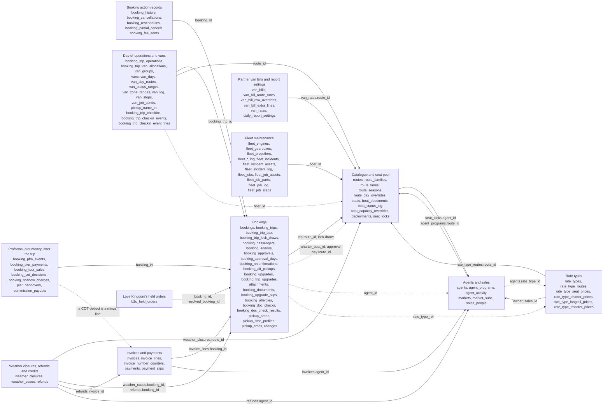

## 1. Catalogue and seat pool

What runs, and how many seats there are to sell. Routes and boats are the catalogue. A
deployment puts a boat on a route for one day, and that is what creates seats.

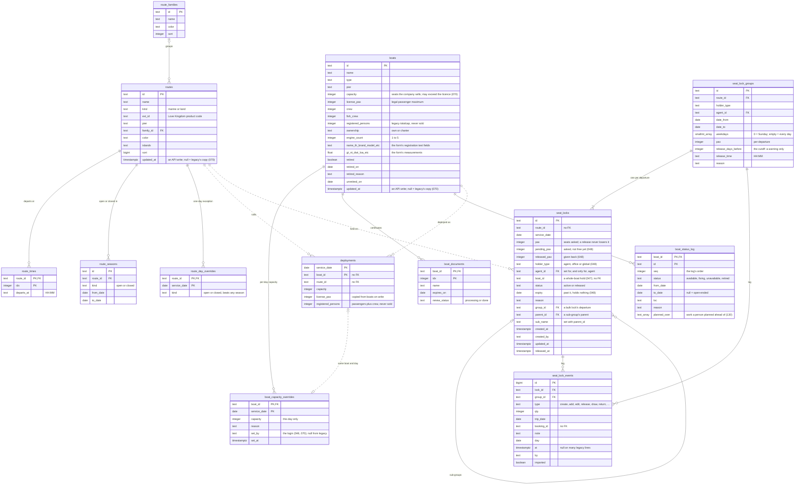

- **Seat locks (048).** A lock is one route and day. A bulk lock is a `seat_lock_groups` row plus one
  lock per departure (`group_id`); a sub-group is a lock with `parent_id`, on its parent's route and
  day, one level deep. Only a top-level lock holds seats in the pool: `pax − released_pax − drawn −
  pending_pax`, its sub-groups dividing that. Expiry, the release cutoff and `overdue` are worked out
  on read (`src/domain/seat-locks.ts`), never written into `status`.

- **A boat sails one route per day.** `deployments` is keyed on `(service_date, boat_id)`, so
  deploying the same boat again that day *moves* it rather than adding a second row.
- **Seats a boat sells** = the day's override capacity (or else the deployment's capacity), capped
  at `license_pax`. `registered_persons` is passengers plus crew and is never a selling limit. The
  rule is written once, in `src/domain/capacity.ts`. Since 070 `boats.capacity` may exceed
  `license_pax` (legacy allows it); the cap above is what keeps sales legal.
- **A deployment copies its boat's numbers** (`capacity`, `license_pax`, `registered_persons`). A boat
  edit rewrites them on the boat's deployments from today on (`PATCH /v1/boats/{id}`).
- **The catalogue is edited here** (070): `updated_at` marks a row edited through the API, which
  `seed:routes` and `seed:boats` never overwrite. `routes.ext_id` is unique (Love Kingdom's create
  is idempotent on it). `route_families` replaces legacy's hard-coded family list.
- **A boat's status** is `boat_status_log`, legacy's date ranges; the status on a date is the latest
  range covering it (`storedStatus` in `src/domain/catalogue.ts`). Whether it can sail adds the open
  work holding it (section 9, `availability` in `src/domain/fleet-availability.ts`), less the work an
  entry's `planned_over` names.
- **Seats left on a route-day are computed, not stored.** Each read sums what is deployed and
  subtracts what bookings and active locks hold. There is no counter column to fall out of step.
- **Whether a route runs on a date** is decided from `route_seasons` and `route_day_overrides` by
  `src/domain/calendar.ts`. A day override beats any season.
- **Land routes** (`kind = 'land'`) have no boats, so they have no deployments and no seats yet.
- **A seat lock** holds seats on one route-day for an agent. Bookings draw from it (see
  `booking_trip_lock_draws` below), and what it still holds is `pax` minus those draws.

## 2. Bookings

A booking is a **sale**. A trip is a **departure**. Seats are counted per trip, which is how one
booking can span several days.

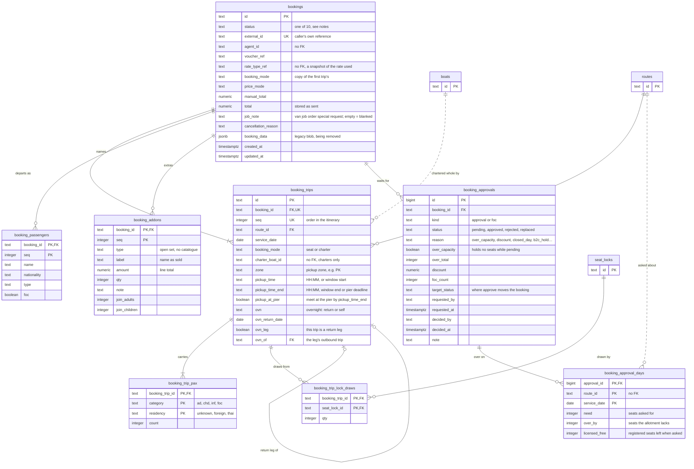

- **Every booking has at least one trip, and every trip at least one pax row.** The API
  enforces this. The database can't: a plain constraint has no way to say "at least one child row".
- **A booking holds seats unless its status is `cancelled`, `rejected` or `cancelled_weather`,** or
  it is `pending_approval` with a pending approval that is over the allotment
  (`over_capacity = true`). The ten statuses are listed in `src/domain/booking-status.ts`, and the
  approval exception is `bookingHoldsSeats` in `src/domain/booking-approvals.ts`. The database only
  checks that the status is one of the ten.
- **A charter takes a whole boat.** `charter_boat_id` names it, and all that boat's sellable seats
  leave the pool, however few passengers the charter carries.
- **A lock draw** says how many of a trip's seats came out of an agent's seat lock, so those seats
  aren't counted twice. A lock that has been drawn from can't be deleted: the foreign key has no
  `ON DELETE`.
- **Overnight trips:** a trip with `ovn = 'return'` is the outbound. Its return leg is a separate
  trip with `ovn_leg = true` and `ovn_of` pointing back at it.
- **Passengers and add-ons are whole lists.** An amendment that sends them replaces every row.
- **An approval is a row per request, kept after it is decided.** `kind` is `approval` (over the
  allotment and/or a discount) or `foc` (free passengers). A booking has at most one `pending`
  approval per kind: asking again marks the old one `replaced`. `booking_approval_days` keeps the
  route-days an over-allotment approval was about, as they were when it was asked. A legacy-imported
  `pending_approval` booking has no approval row, and holds its seats.
- **Deleting a booking deletes everything under it.** Its trips, pax, passengers, add-ons,
  approvals and action records all cascade.

The `bookings` box shows the structural columns. The other 57 columns are the header: values the
booking form writes, one column each. `foc_reason` came in migration 023, the rest in 011.

| Group | Columns |
| --- | --- |
| Sale | `schema_ver` `sold_by` `purpose` `staff_id` `staff_purpose` `booking_date` `booked_at` `created_by` `updated_by` `confirmed_at` `confirmed_by` |
| Lead passenger | `lead_pax` `lead_nationality` `lead_type` `lead_foc` `lead_phone` `lead_email` |
| Pickup and drop-off | `pickup_area_id` `pickup_self` `pickup_area` `pickup_zone` `hotel_name` `room_number` `dropoff_same` `dropoff_area_id` `dropoff_area` `dropoff_hotel_name` |
| Guides | `guide_english` `guide_russian` `guide_chinese` `guide_other_lang` |
| Passenger needs | `pax_type` `special_meals_veg` `special_meals_vegan` `special_meals_halal` `special_meals_allergies` `large_luggage` |
| Cash on tour | `cash_on_tour_amount` `cash_on_tour_currency` `cash_on_tour_handling` `cash_on_tour_note` |
| Price breakdown | `price_seat` `price_addon` `price_foc_discount` `price_discount` `price_extra` |
| Payment snapshot | `payment_method` `payment_net_days` `payment_source` `payment_contract_version` |
| Market snapshot | `market` `market_sub` `market_agent_id` `market_at` |
| Notes | `notes` `note` |
| FOC | `foc_reason` |

How each header column is parsed from a request is in `src/domain/booking-header.ts`.

## 3. Booking action records

What the booking actions record beyond the seat change: who did it, why, and what it cost. The rules
are in `src/domain/booking-actions.ts`. These tables only hold the results.


- **`booking_history`** gets one line per write, in the same transaction as the write.
- **`booking_cancellations`** holds only the *current* cancellation: at most one row, and a restore
  deletes it. Earlier cancellations survive as history lines.
- **`booking_reschedules`** and **`booking_partial_cancels`** are append-only: a new row each time,
  never updated. Only the full request body writes one. The older bodies (a bare move, a bare
  passenger count) change the trips and leave a history line only.
- **`booking_partial_cancels.booking_trip_id` has no foreign key on purpose.** The record must
  outlive a trip that a later edit removes. `service_date` still says which departure it was.
- **What the agent owes** is `bookings.total` plus the booking's `booking_fee_items`. A fee never
  changes `total`.

## 4. Day-of-operations and vans

Who drives, which van, and who rides with whom. These tables are filled by the legacy import
(`src/tools/import-legacy.ts`) and written through the dispatch, van-group and vans endpoints
(README: "Dispatch", "Van groups", "Vans and the month matrix"). What is still to build is in
`todo/trip-ops-and-vans-model.md`.

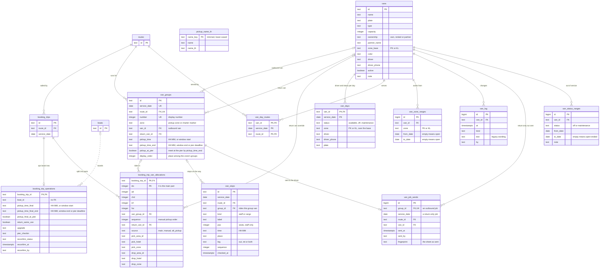

- **A trip's passengers can be split across vans.** A trip with no allocation rows rides as one
  whole part. Part `idx = 0` is the main part, and further parts are splits or alternate pickups.
- **A van group is one outbound van run.** The group holds the van, so passengers grouped together
  can't disagree about which van they're on. Its `zone` is the pickup zone it collects from, or
  `__CHARTER__` for a charter's own van. Deleting a group leaves its allocations ungrouped rather
  than deleting them.
- **Whether a van works on a date:** a `van_days.status` override beats any `van_status_ranges`
  range. `van_day_routes` is the month matrix of which routes a van serves on which dates.
- **Vans are never deleted:** a retired van is set inactive. The foreign keys onto `vans` have no
  `ON DELETE`, so a van still in use can't be removed anyway.
- **Moving a trip to another route or day clears its van data,** because it was arranged for the
  old departure (`writeTrips` in `src/domain/postgres-operations.ts`).
- **Van job orders are computed, not stored** (`src/domain/van-jobs.ts`, README "Van job orders").
  What is stored is around them: `van_job_sends` (sent to the driver, one per job: on the group, or
  on date, route and van for a van that only brings people back; it goes with its group or van),
  `pickup_name_th` (Thai names printed under a pickup, keyed by the place trimmed and
  lower-cased), `van_groups.display_order` and `bookings.job_note`.

## 5. Agents and sales

The resellers who sell trips, the markets they sell into, and the salespeople who own them. `users` are
the staff logins (migration 027): a salesperson's login approves discounts on their agents' bookings, and
sees only their agents. This API is the master for this area since 2026-10-09 (migration 090,
todo/sales-editing-model.md); the legacy import seeds it once with legacy's ids (`--sales`).

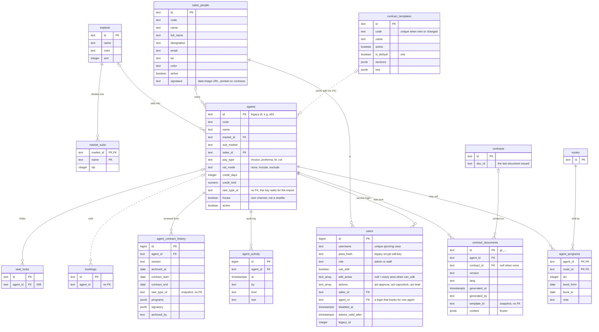

- **`agent_programs`** lists the routes an agent may sell, with the booking window sales entered.
- **`house` agents** (`a_walkin`, `a_staff`, `a_company`, `a_b2c`) are channels the business sells
  through itself, not resellers.
- **Agents are deactivated, not deleted** (`active`): a delete is refused while a booking, contract, seat
  lock, invoice or login names the agent.
- **`agent_contract_history`** is what a renewal archives: legacy's renewal edits the agent's contract
  fields and makes no contract row.
- **`contract_templates`** hold the wording a contract prints with; `agents.contract_template_id` has no
  foreign key (legacy binds agents to templates the import writes later), and deleting a template
  unbinds its agents. **`contract_documents`** are the documents issued, frozen as printed.
- **`agents.code`** is unique for a new or changed code, checked by the write: 21 legacy codes are
  shared, so there is no constraint yet.

The `agents` box shows the structural columns. The rest describe the agent:

| Group | Columns |
| --- | --- |
| Contact | `contact` `email` `phone` `note` `color` |
| Contract | `contract_template_id` `contract_status` `contract_version` `contract_start` `contract_end` |
| Company | `legal_name` `tax_id` `tat_license` `address` `company_tel` `hotline` `fax` `website` |
| Signatory | `signatory_name` `signatory_designation` `signatory_tel` `signatory_signed_date` |
| Booking channel | `booking_method` `booking_cutoff` `booking_cancel_policy` `booking_email` `booking_phone` |
| Audit | `created_at` `updated_at` |

### Add-on services and nationalities

`addon_services` (`id`, `name`, `type` boat/van/guide/other, `description`, `active`, `sort`) and
`addon_service_variants` (`service_id`, `seq`, `id`, `name`, `unit`, `selling`, `net`): the add-on catalogue
(migration 091). `nationalities` (`code` PK, `name`, `builtin`, `sort`, `created_at`, `created_by`): legacy's
73 built-ins, seeded by migration 092, and the custom ones the booking form adds. Passengers'
nationalities stay free text (no foreign key).

Insurance (migration 093) is on the passengers: `bookings.lead_age`, `lead_insurance_reviewed_at`,
`lead_insurance_reviewed_by`, and `booking_passengers.age`, `insurance_reviewed_at`, `insurance_reviewed_by`.

## 6. Rate types

The price lists agents are sold at (migration 022). A rate type is a header; every price hangs off
one of its routes. The API reads and writes them, and the legacy import fills them with legacy's
ids. Nothing prices a booking from them yet. The API is in `README.md`, "Rate types"; pricing is `todo/pricing-model.md`.


- **Each price table points at `rate_type_routes` with a two-column key,** `(rate_type_id,
  route_id)`. A price exists only for a route on the rate, and taking the route off the rate deletes
  its prices. Deleting a rate type deletes its routes and all their prices.
- **Only tier `net` is billed.** `sell` and `min_sell` are printed on contracts.
- **A zone, a boat type, a vehicle or a route is a row,** so none of them needs a migration. Which
  zones a route takes depends on its pier, and the API checks it, not the database.
- **`valid_from`/`valid_to` and `travel_from`/`travel_to` do not stop a sale.**
- **A rate type that an agent or a booking names can't be deleted** through the API (`409`). The
  database would allow it: neither `agents.rate_type_id` nor `bookings.rate_type_ref` has a key.

## 7. Invoices and payments

Legacy's accounting (migration 045, `todo/money-model.md` slice 1). The rules are in
`src/domain/invoices.ts`. An invoice's status is not a column: `voided` and the payments decide it.

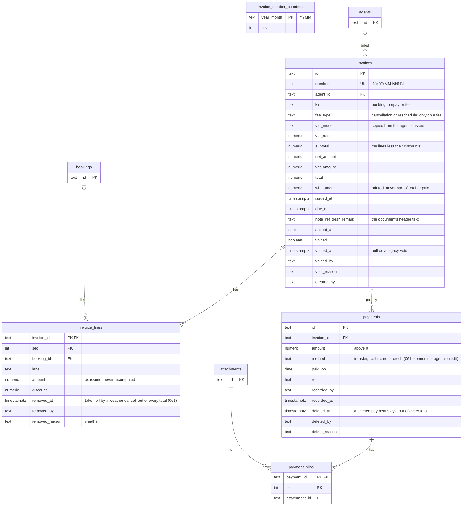

- **A booking's invoice** is found through its lines: a fee invoice has one line naming the booking.
- **One live invoice per booking** is checked by the API, not the database. A partial unique index
  can't see `voided` through the join, and legacy has one booking with two.
- **`changes.kind`** also takes `invoice` (045).

## 8. Love Kingdom's held orders

A write from Love Kingdom's login that was refused as bad input, kept as it was sent for ops to
handle (migration 100, README "Love Kingdom's push").

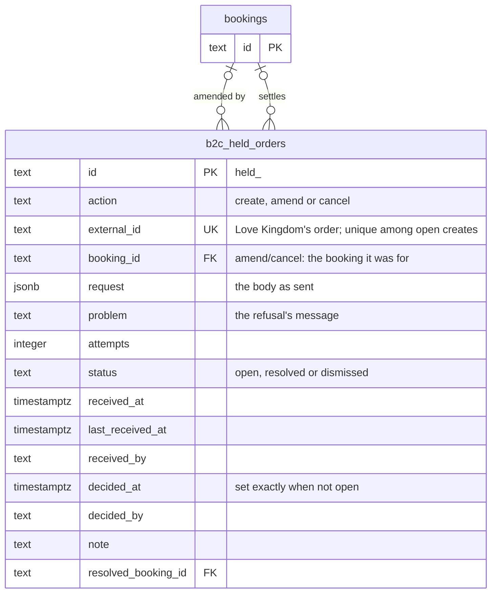

- **One open held create per order:** a partial unique index on `external_id` where
  `status = 'open' AND action = 'create'`. A retry updates that row (`attempts`).
- **Both booking keys are `ON DELETE SET NULL`:** the held order outlives a booking the import
  replaces.
- **`changes.kind`** also takes `b2c_held_order` (100). The migration adds it to whatever list the
  constraint has, so another branch's kind is kept whichever runs first.
## 8. Weather closures, refunds and credits

Legacy's weather cancel (migrations 060 and 061, `todo/weather-closures-model.md`). The rules are in
`src/domain/weather.ts` and `src/domain/refunds.ts`. The follow-up list is not stored: it is the
bookings on the closed trip plus the rows of `weather_cases`, worked out on read.

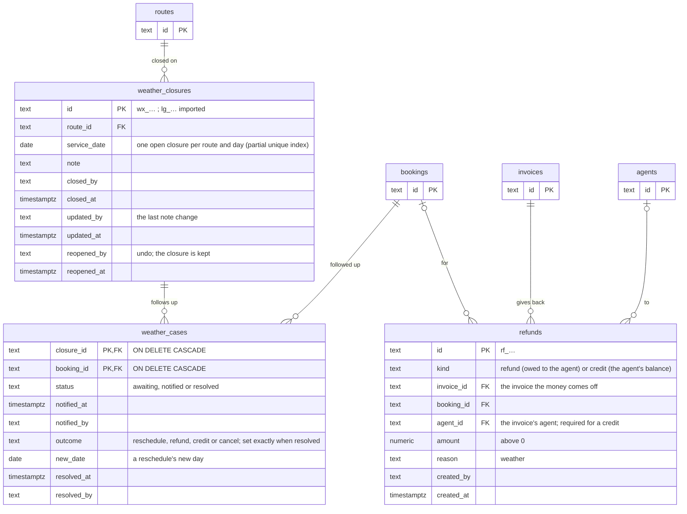

- **A row is written only when something happens to a booking** (notified, resolved, imported). A
  booking on the trip with no row reads `awaiting`.
- **The agent's credit balance** is its `credit` rows less its live payments with `method = 'credit'`.
- **`changes.kind`** also takes `weather_closure` (060).

## 9. Partner van bills and report settings

Legacy's partner van bill (`§vanBill`), Transfer Fleet's van rates and the daily report's settings
(migration 120, `todo/money-model.md` slices 5 and 6). The rules are in `src/domain/van-bills.ts` and
`src/domain/money-reports.ts`. **A bill's rows and amounts are not stored:** they are worked out on
every read from the bookings' van parts and check-ins. Only what staff type is kept, plus the sent
and paid state (new; legacy had none). The money reports store nothing.

```mermaid
erDiagram
  van_bills {
    text id PK "vb_…"
    text partner "a van's partner_name, trimmed; unique with month and period"
    text month "YYYY-MM"
    smallint period "1 = days 1–10, 2 = 11–20, 3 = 21–end"
    numeric per_pax "sale price per passenger"
    numeric rate "the old single default rate per van"
    text_array seen "row keys at the last save with mark_seen; NULL = never"
    timestamptz updated_at
    text updated_by
    timestamptz sent_at "sent to the van owner"
    text sent_by
    numeric sent_bill "the total when sent"
    timestamptz paid_at "needs sent_at"
    text paid_by
    date paid_on
    text paid_via "transfer, cash or cheque"
    text paid_ref
    numeric paid_amount "the total when paid"
  }
  van_bill_route_rates {
    text bill_id PK, FK "ON DELETE CASCADE"
    text code PK "PP, PB, MT, SM, SR or —"
    numeric rate
  }
  van_bill_row_overrides {
    text bill_id PK, FK "ON DELETE CASCADE"
    text row_key PK "date~route~van, ~R for a return-only run"
    numeric rate "NULL = not set (0 is a rate)"
    numeric ex
    numeric cut
    numeric per
  }
  van_bill_extra_lines {
    text bill_id PK, FK "ON DELETE CASCADE"
    text id PK
    int seq "unique per bill"
    date line_date
    text note
    int vans
    int pax
    numeric rate
    numeric ex
    numeric cut
    numeric per_pax
  }
  van_rates {
    text group_key "own, or p:<partner>"
    text route_id FK "NULL = the group's base; ON DELETE CASCADE"
    text field "base, PK or KL; a NULL route is base"
    numeric rate
    timestamptz updated_at
    text updated_by
  }
  daily_report_settings {
    boolean id PK "one row"
    numeric van_cost "NULL = 1,200"
    int van_quota "NULL = 6"
    numeric target_per_pax "NULL = 130"
    timestamptz updated_at
    text updated_by
  }
  routes { text id PK }
  van_bills ||--o{ van_bill_route_rates : "defaults"
  van_bills ||--o{ van_bill_row_overrides : "typed on rows"
  van_bills ||--o{ van_bill_extra_lines : "hand-typed lines"
  routes |o--o{ van_rates : "priced on"
```

- **`van_rates` is unique on (group, route, field) with `NULLS NOT DISTINCT`**, so a group has one base.
- **A bill names its partner by name, not by a key:** legacy's bill is per owner name, and vans carry
  that name (`vans.partner_name`). Renaming a partner's vans leaves its old bills under the old name.
- **Every amount is `NUMERIC(12,2)` and 0 or more**; a deduction (`cut`) is stored positive.

## 10. Fleet maintenance, part A: assets, incidents, jobs

Legacy's Fleet screens, part A (migration 130, `todo/fleet-maintenance-model.md`). The rules are in
`src/domain/fleet-availability.ts`, `fleet-assets.ts` and `fleet-jobs.ts`. Each record is written
whole: its row upserted, its lists (`*_log`, assets, parts, steps) replaced in order (`seq`/`idx`).

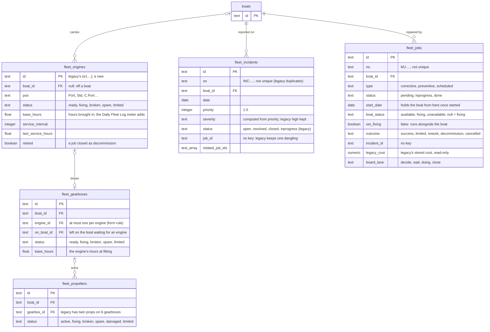

- **Child tables** (each `ON DELETE CASCADE`): `fleet_engine_log`, `fleet_gearbox_log`,
  `fleet_propeller_log` (the same columns: `date, type, description, detail, text, hours,
  engine_hours, used_hours, from_loc, to_loc, incident_id, outcome, cost, by`);
  `fleet_incident_assets`, `fleet_incident_log`; `fleet_job_assets`, `fleet_job_parts`,
  `fleet_job_log`, `fleet_job_steps`.
- **Numbers are the client's** (decided 2026-10-09): a new one already used is refused by the API,
  but legacy's duplicates are kept, so `no` has an index, not a unique one.
- **A job holds its boat** while `inprogress`, from `start_date`, unless `set_fixing` is false or
  `boat_status` is `available`. Nothing stores the effective status; it is computed on read.
## 9. Proforma, pier money and after the trip

Money slices 2–4 (migrations 110–112, `todo/money-model.md`). The rules are in `src/domain/pfm.ts`,
`src/domain/pier-money.ts` and `src/domain/after-trip.ts`. Nothing derived is stored: the PFM row,
the amount owed at the pier, a sale's total and commission, a hand-over's difference are worked out
on read. Every booking-owned row goes with its booking (`ON DELETE CASCADE`).

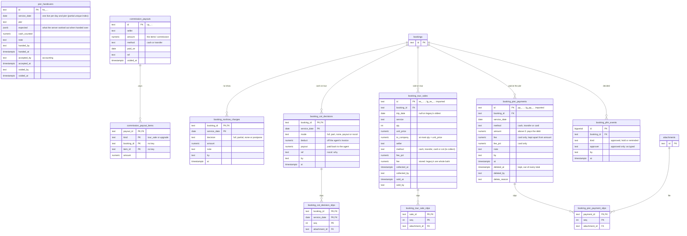

- **`bookings`** gains Love Kingdom's payment state: `payment_paid`, `payment_paid_status`,
  `payment_deposit`, `payment_balance` (111).
- **`invoice_lines.cot_date`** (112): set on a cash-on-tour deduction's minus line, one per trip date.
- **`changes.kind`** also takes `pier_handover` and `commission_payout` (111).

## 11. Fleet maintenance, part B: stock, memos, projects, Daily Fleet Log, safety

Migrations 140–143 (`todo/fleet-maintenance-model.md`, "Design — part B"). The rules are in
`src/domain/fleet-*.ts`; both stores reach these tables through `store.fleetRepo` (`fleet-store.ts`,
`fleet-postgres.ts`). Part A's jobs and engines are named by text ids (`job_id`, `engine_id`).

```mermaid
erDiagram
  fleet_warehouses { text id PK "tublamu, panwa, ranong" text name "legacy's label" }
  fleet_stock_items {
    text id PK "legacy's id; inv_…"
    text name "name + part_no unique among live items (checked by the API)"
    text part_no
    numeric min_qty
    numeric cost
    timestamptz deleted_at "never deleted: hidden"
    text merged_into FK "a merged duplicate"
  }
  fleet_stock_movements {
    bigserial seq PK
    text id "lg_… imported"
    text item_id FK
    date date
    text type "register, receive, withdraw, transfer-in/out, edit, merge, adjust, adjust_out, in, return, reverse, import"
    text warehouse FK "required when delta is not 0"
    numeric delta "signed; stock = sum by item and warehouse"
    text memo_id FK
    text job_id "part A, text"
    text consumable_id FK
    jsonb changes "an edit's [{field, from, to}]"
  }
  fleet_consumables { text id PK date date text item_id FK numeric qty numeric cost text warehouse FK text boat_id FK timestamptz voided_at }
  fleet_memos {
    text id PK
    text no "client's number; not unique (legacy has two duplicates)"
    text status "pending_approval, approved, ordered, received, paid, cancelled"
    smallint current_step
    numeric amount "computed; imported as legacy stored it"
    text boat_id FK
    text project_id FK
    text job_id "part A, text"
    jsonb short_closed
    text cancel_reason
  }
  fleet_memo_lines { text id PK text memo_id FK numeric qty numeric price text category text item_id FK numeric received_qty }
  fleet_memo_history { bigserial id PK text memo_id FK text type text by timestamptz at }
  fleet_memo_receipts { text id PK text memo_id FK date date text warehouse FK jsonb lines }
  fleet_projects { text id PK text no "client's" text boat_id FK "null = General" text status date original_plan_to "baseline" jsonb no_cost }
  fleet_project_log { bigserial id PK text project_id FK date date text text }
  fleet_project_plan { text project_id PK, FK text id PK boolean done }
  fleet_project_documents { text project_id PK, FK text id PK text attachment_id FK text url text status }
  fleet_project_vendor_visits { text project_id PK, FK text id PK text vendor }
  fleet_daily_boats { date date PK text boat_id PK, FK numeric fuel_litres int pax_actual }
  fleet_daily_meters { date date PK text boat_id PK, FK text trip_type PK text engine_id PK "part A, text" numeric reading }
  fleet_fuel_prices { date date PK text key PK "pier or boat" numeric price }
  fleet_daily_locks { date date PK text pier PK timestamptz locked_at }
  fleet_water_meters { date date PK text boat_id PK, FK numeric open_reading numeric close_reading }
  fleet_issue_items { text id PK text name text pier boolean off }
  fleet_issues { date date PK text boat_id PK, FK text item_id PK, FK numeric qty }
  fleet_daily_extras { text id PK date date text boat_id FK text name }
  fleet_daily_requests { text id PK date date text pier text name jsonb issues }
  fleet_safety_items { text id PK text boat_id FK text category date expiry_date date next_pm }
  fleet_safety_inspections { text id PK text item_id FK date date text result date next_due }
  fleet_safety_log { bigserial id PK text item_id FK text type }
  fleet_stock_items ||--o{ fleet_stock_movements : "moves"
  fleet_warehouses ||--o{ fleet_stock_movements : "in"
  fleet_memos ||--o{ fleet_memo_lines : "lists"
  fleet_memos ||--o{ fleet_memo_history : "logs"
  fleet_memos ||--o{ fleet_memo_receipts : "received in"
  fleet_memos |o--o{ fleet_stock_movements : "brought"
  fleet_stock_items |o--o{ fleet_memo_lines : "for"
  fleet_projects |o--o{ fleet_memos : "pays for"
  fleet_projects ||--o{ fleet_project_documents : "files"
  fleet_issue_items ||--o{ fleet_issues : "issued"
  fleet_safety_items ||--o{ fleet_safety_inspections : "checked"
```

- **Movements are append-only in the schema:** a trigger refuses `UPDATE` and `DELETE`, except on
  imported `lg_` rows inside the import's transaction (`SET LOCAL fleet.import_rewrite = 'on'`).
- **`fleet_daily_locks`:** a row means the pier's day is locked; every Daily Log write to it is
  refused (`409 day_locked`).
- **A project's boat entries** are rows of the boat's status log with `project_id` set.

## 12. Fleet maintenance, the extras: pier assignments, fuel budget

Migration 190 (`todo/fleet-maintenance-model.md`, "Design — extras"). Certificates' state, the replace
wizard, the reports and the Daily Log flags add no table: they compute from what is stored or write
part A's and part B's rows. Both stores reach these through `store.fleetRepo`.

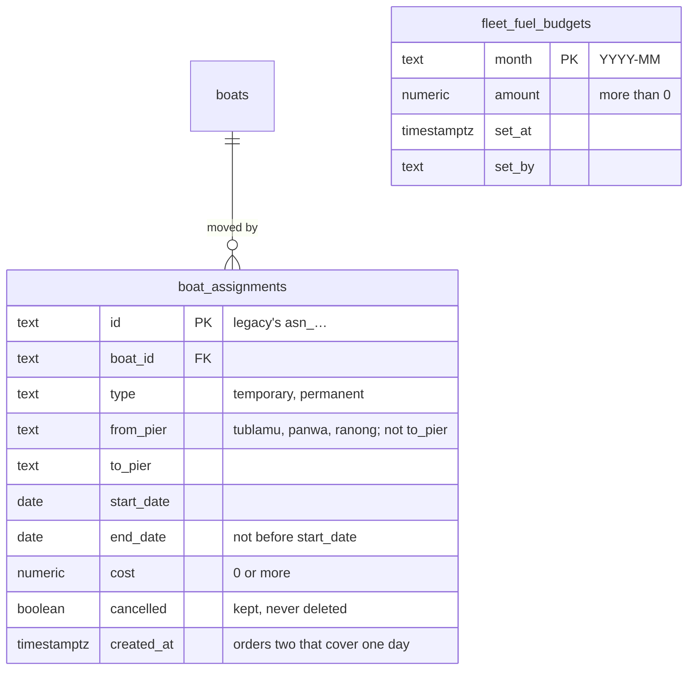

- **An assignment's status** (planned, active, completed) is computed from its dates, never stored.
- **A boat's pier on a day** (`pierOn` in `src/domain/fleet-assignments.ts`) reads the assignments,
  the boat's status log and its home `pier`; the Daily Log's day lock follows it.

## Ids with no foreign key

These columns hold another table's id, but the database does not check it. Where a migration
gives a reason, it is quoted; otherwise the table says what happened.

| Column | Points at | Why there is no key |
| --- | --- | --- |
| `booking_trips.charter_boat_id` | `boats` | The real rule, "deployed on this route that day", is stronger than a key, and both stores check it before writing (014). |
| `deployments.boat_id` | `boats` | Left out for the same reason. 014 says it and `charter_boat_id` "should gain a key together". |
| `deployments.route_id` | `routes` | Created (001) before the route catalogue existed (005). 008 added a key for `booking_trips.route_id` only. |
| `seat_locks.route_id` | `routes` | Same as `deployments.route_id`. |
| `booking_trip_operations.boat_id` | `boats` | Created without one (013). No API writes the column yet. |
| `bookings.agent_id` | `agents` | Created (002) before the agents table (017). No key was added when it arrived. |
| `seat_locks.boat_id` | `boats` | A whole-boat hold's boat (047), keyless like `deployments.boat_id`. |
| `booking_partial_cancels.booking_trip_id` | `booking_trips` | Deliberate: the record must outlive a trip a later edit removes (020). |
| `booking_approval_days.route_id` | `routes` | Created without one (023). |
| `agents.rate_type_id` | `rate_types` | Created (017) before the rate types table (022). The key can only ship after the rate types import has run in production; until then agents hold ids `rate_types` does not have (`todo/rate-types-model.md`). |
| `bookings.rate_type_ref` | `rate_types` | Free text for good: it is a historical snapshot, and a deleted rate must not break old bookings. |
| `fleet_memos.job_id`, `fleet_stock_movements.job_id` | part A's maintenance jobs | Built in parallel with `fleet_jobs` (140); legacy's are imported as they are. Legacy names one deleted job (`mjmtsfprvltstem`). |
| `fleet_daily_meters.engine_id`, `fleet_consumables.engine_id` | part A's engines | Same. |
| `fleet_fuel_prices.key`, `fleet_daily_locks.pier`, `fleet_daily_requests.pier` | piers or `boats` | A price key is a pier or a boat; piers have no table. |
| `fleet_incidents.job_id`, `fleet_jobs.incident_id` | `fleet_jobs`, `fleet_incidents` | Legacy keeps an incident linked to a deleted job, and deleting an incident leaves its job's link (130). |
| `fleet_jobs.parent_project_id` | `fleet_projects` | The two were built in parallel (130, 141); legacy's are imported as they are. |
| `commission_payout_items.booking_id`, `item_id` | `booking_tour_sales`, `booking_upgrades` | An upgrade list is rewritten whole on every save, and an import replaces bookings (111). |
| `pier_handovers.pier` | `routes.pier` | A pier is a route's text field, `other` when none (111). |

There is also no users table. Every `by` and `*_by` column is a username stored as plain text. On a
write through the API, `updated_by` and the action records' `by` come from the caller's Bearer
token (`actorOf` in `src/domain/booking-actions.ts`).
